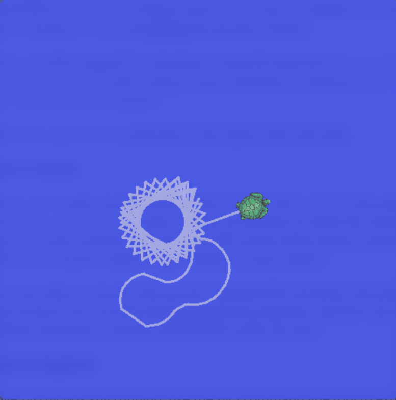
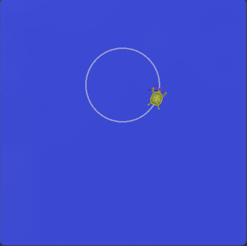
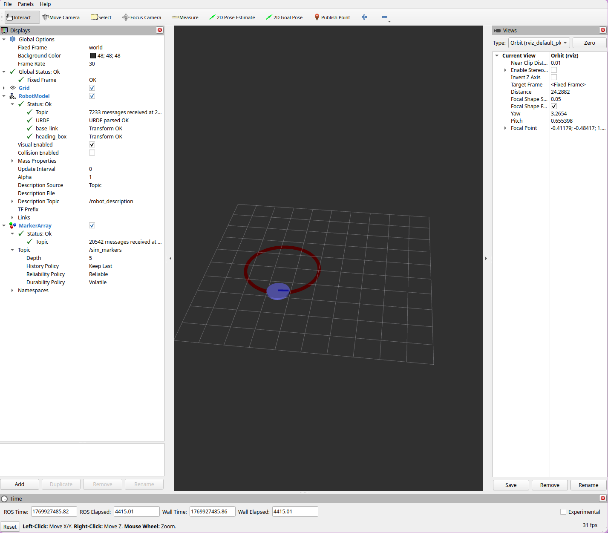

## Task 2: Install 

### Part 1: Capture a screenshot of your creation and include it in your report. 

{ width=70% }

\newpage

## Task 3: Explore

### Part 1. Find a list of all of the topics in the system.

Running `ros2 topic list -t` I found:
```
/parameter_events [rcl_interfaces/msg/ParameterEvent]
/rosout [rcl_interfaces/msg/Log]
/turtle1/cmd_vel [geometry_msgs/msg/Twist]
/turtle1/color_sensor [turtlesim/msg/Color]
/turtle1/pose [turtlesim/msg/Pose]
/turtle2/cmd_vel [geometry_msgs/msg/Twist]
/turtle2/color_sensor [turtlesim/msg/Color]
/turtle2/pose [turtlesim/msg/Pose]
```

**Note:** I spawned in a 2nd turtle, hence turtle2

### Part 2: Choose one of these topics to use for the rest of Task 3.

I will choose: `/turtle1/color_sensor`

### Part 3: Find the name of your topic's data. Find the number of publishers and the number of subscribers.

**Type:** `turtlesim/msg/Color`  
**Publisher Count:** 1  
**Subscriber Count:** 0

### Part 4: Find the details of your topic's data type:
```
uint8 r
uint8 g
uint8 b
```

### Part 5: Find the total number of interfaces in your ROS installation, including message types, service types, and action types

Using `ros2 interface list | wc -l` I got **303** types.

### Part 6: Find the number of packages in your ROS installation that start with the letter 's'.

Using `ros2 pkg list | grep '^s' | wc -l` I got **13** packages.

\newpage

## Task 4: Implement

### Part 1: Program Requirements

Write one program using Python to:

- Publish messages on the topic `/turtle1/cmd_vel` that tell the turtle to move slowly forward with a slight turn to the left. The program publishes the same message approximately once per second, causing the turtle to move smoothly in a circular pattern.

- Subscribe to messages on the topic `/turtle1/color_sensor`. When a message is published on that topic, the program prints the message to the console.

Please reference the submitted zip file for my code.

### Part 2: Build and Run Commands

**Build the package:**

Command: `colcon build`

Output:
```
Starting >>> circle
Finished <<< circle [2.18s]
Summary: 1 package finished [2.36s]
```

**Source the workspace:**

Command: `. ./install/setup.bash`

Output: None

Note: pwd was inside ROS Workspace for Circle package.

**Run turtlesim node:**

Command: `ros2 run turtlesim turtlesim_node`

Output: Turtlesim window opened

**Run circle node:**

Command: `ros2 run circle circle_node`

Output (excerpt):
```
[INFO] [circle_node]: Circle Node has been started.
[INFO] [circle_node]: Received color from 
  /turtle1/color_sensor: r=255, g=255, b=255
[INFO] [circle_node]: Received color from 
  /turtle1/color_sensor: r=255, g=255, b=255
[INFO] [circle_node]: Received color from 
  /turtle1/color_sensor: r=255, g=255, b=255
...
[INFO] [circle_node]: Publishing circle command: 
  linear.x=0.50, angular.z=0.30
```

**Note:** The color sensor publishes at a high frequency, resulting in many color messages being printed to the console. The publishing command appears once per second as expected.

\pagebreak 

### Part 3: Screenshot of turtle drawing the circle

{ width=70% }

## Task 5: Install Sim Package 

### Part 1: Confirm that the sim package is recognized by the ROS system by using the command: `ros2 pkg prefix sim`
    Command: `ros2 pkg prefix sim`
    Output: `/home/tyler/Coding_Workspace/CSCE_752/ROS_WS/install/sim'

\pagebreak

## Task 6: Visualize 

### Part 1: Screenshot of Rviz2 Window

{ width=70% }
